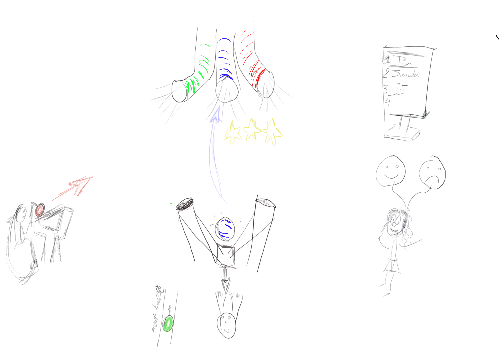

# Add Attachment
## project intro

<elevator pitch>

## Game Flow

### high level flow

We want to induce competitive stress for a child and monitor his/her response.  

A [[trial]] is run a couple of times in a row, forming a [[trialblock]]

During a trial, we measure different [[metrics]]

- [[shooting system]]: In a trial, a child is seated in which he can shoot a ball with a giant slingshot towards three pipes. 

- [[targets]]: These pipes try to suck the ball towards them. 

- [[reward system]]: When we shoot the ball in the correct hole, we get some points.  

Alternating with us, another [[NPC player]] shoots as well, and we see how (s)he performs.  

After 5 shots for both players, the trial is finished, and the results are shown on the [[score board]]. 

The [[caregiver]] gives feedback.  

After this, you can [[caregiver#score the caregiver]]. 

A [[trial#count-down timer]] indicates that a new trial will start, or, if we are at the end, a closing screen will be shown.