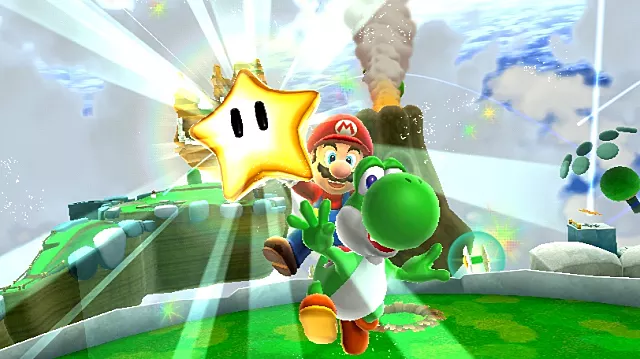

# reward system
If a player shoots in one of the correct [[targets]], then (s)he sees an immediate reward.

Above the target a particle appears, such as a star appearing above the goal.

These rewards are counted and passed on to the [[score_board]].