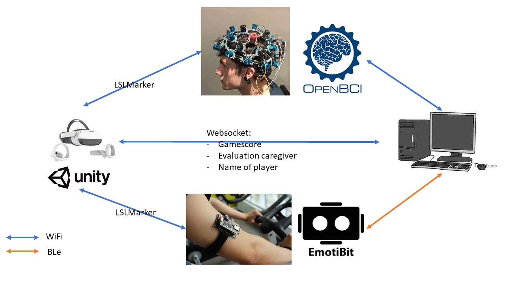

# Data Streams

> we have multiple datastreams to be connected throughout the research project. 
> All data eventually needs to be captured on a single computer, in order to process that later.

Past researchers created a model stream to be used with GSR & EEG data. [LabStream layer](https://github.com/labstreaminglayer/), check out the [documentation](https://labstreaminglayer.readthedocs.io/)!

We'll leverage this framework and use it in Unity and with our EEG and GSR devices.

Here's an overview. 

	Warning, this is **not** how it's implemented in reality, this is merely to give a sense of how the datastreams. In reality all OpenBCI and emotibit data is streaming towards the PC. The LSLMarker stream injects these streams. Yet it is easier to comprehend that the LSLMarker stream intervenes directly in the hardware.

## Data Structure

- a name for the folder creation:
	- python script to create a default folder structure
- per trial:
	- trial setup (contingency, what will be the response)
	- score at the end?
	- EOG data
	- trust in caregiver
	- something else? #TBD 

## Unity Side

Unity is the Master, creating the labstream layer: [LSL for Unity](https://github.com/labstreaminglayer/LSL4Unity)

We need to decide which events we want to record. We'll give them a marker-notation:

|Marker|meaning|
|---|---|
|1|start of recording|
|2|kid looks at the caregiver|

## EEG Side

We'll use the [Brainflow](https://brainflow.readthedocs.io/en/stable/) framework. This is a unified framework to be used with different EEG headsets. By creating a python script which also captures the markers, we can have the same markers as [[Data streams#Unity side]] and [[Data streams#GSR side]].

We'll capture the markers and inject them in the EEG data, this way we can afterwards retrieve them in the data and take a look with the oscilloscope where the interesting parts in the data are.

## GSR Side

The GSR data is recorded via an openframeworks application. We can use the LSL Marker stream to capture the data and inject the markers into the data.

## Python Websocket

We'll perhaps need a python script to open a websocket to:

- transmit name towards the Unity game?
- Get some meta-data or other data?
	- scorings of caregiver
	- points taken within the game
	- ...
