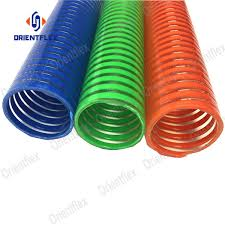

# shooting system

>In shooting system we take a closer look at the shooting mechanism. 
>We want to child to be seated, yet have the feeling to be participating in a real competition
>We want to be able to influence the performance of the child when needed

-   Necessary to be seated and not to move too much 
	-   EEG readings otherwise compromised
## overview

I have one main concepts in mind: 
- the slingshot

### slingshot

The player is seated in some sort of chair, in front of you there's a large slingshot.
When it's your turn to shoot, a ball appears next to you. You grab it and attach it to the slingshot. 
Once this is done, you can pull the slingshot and shoot it. The harder you pull, the harder the ball flies.

On the other side of the room, there are either pipes or trash nets which serve as [[targets]] for the balls. #TBD
 

#### shooting
- assistance: difficulty level?
	- how will the NPC be assisted
	- how can the player be assisted?
- Have an assisting lineray showing were the ball would approx fly?

#### scoring
Having the ball in the correct target gives 1 point.
Depending on how fast you can score, you get an extra point?

## assets

### slingshot

we need a slingshot with which we can interact

### balls

colored balls, perhaps taking their color only slowly?

Or changing color after time? 

! We want to be able to steer the performance of the child. I suggest we have some assistive trajectory change when we want to help the child.