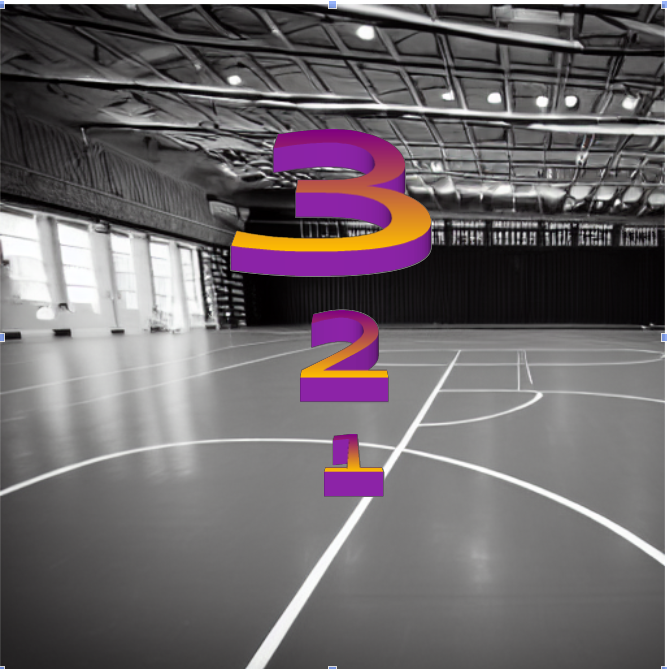

# Trial

A trial exists of a pre-trial phase, a trial phase and a post-trial phase.

Per trial some metrics are defined:

1. number of the trial: integer
2. Assistance level for the NPC: integer
3. Assistance level for the child: integer
4. Response for the caregiver: string (+ perhaps an audio sample)

## Pre Trial

#TBD Correct that we give advice **after** a trial?

## Trial

The player and the NPC shoot balls alternating: one at the time, up to 5 balls. 

This should be fast paced action.

[[shooting_system]]

## Post Trial

The [[caregiver]] gives [[advice]] to the child. 

#TBD correct that the child **does not have** to watch the caregiver in order to get the response?

The child gets a menu to score the caregivers response. [[caregiver#score the caregiver]]

We record whether the child did look at the caregiver [[metrics]]

### Count-down Timer

after giving the score, a countdown is shown on the screen, indicating that the new trial is getting started. We move up one trial in the [[trialblock]] and set the phase to pretrial again.

## Assets

### Trialmanager

a state machine switching the trial phases and updating the trialnumber once a trial has finished.

### Countdown Timer

Large numbers counting down on the screen, with faded lights/foggy view?

