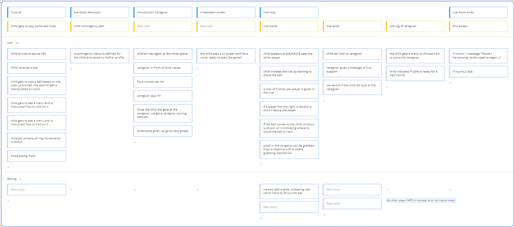

# Add Attachment

## Project Intro

<elevator pitch>

## Table of Contents

```toc 
style: 
	number 
	min_depth: 1 
	max_depth: 6 
```

## Game Goal

We want to induce competitive stress for a child and monitor his/her response towards a caregiver.  

## Game Flow

### High Level Flow


#### A Child Enters in Physical Space

1. The child takes place on a chair. Firstly the [emotibit stress measurement device](https://www.emotibit.com/) gets attached to him.
2. Next we place the [OpenBCI EEG headset](https://openbci.com/) on the head. We test ([[EEG#testing]]) if all electrodes have been placed correctly.
3. Then we place the VR headset on the head of the child and the game can start.
(The VR glass has been adapted to be able to hang from above the child)

#### The Child Enters the VR Space

1. The child enters the [[environment]].
2. First an [[test-trial]] is given to the game environment and mechanics. 
3. A [[trial]] is run a couple of times in a row, forming a [[trialblock]]
4. During a trial, we measure different [[metrics]]

	- [[shooting_system]]: In a trial, a child is seated in which he can shoot a ball with a giant slingshot towards three pipes. 
	
	- [[targets]]: These pipes try to suck the ball towards them. 
	
	- [[reward_system]]: When we shoot the ball in the correct hole, we get some points.  

4. Alternating with us, another [[NPC_player]] shoots as well, and we see how (s)he performs.  
5. After 5 shots for both players, the trial is finished, and the results are shown on the [[score_board]]. 
6. The [[caregiver]] gives feedback.  
7. After this, you can [[caregiver#score the caregiver]]. 
8. A [[trial#count-down timer]] indicates that a new trial will start, or, if we are at the end, a closing screen will be shown.

## Asset List

a brief overview of all assets that need to be created: [[assets]]

## Timeline




## Sound Design

	#TBD
using [FMOD](https://www.fmod.com/docs/2.02/unity/integration-tutorial.html)

## Visual Style

I suggest going for a more cartoonesk Gorillaz like vibe: enough detail to get familiar with, enough abstract to be generic enough.

Using this style, things look less realistic. Yet I believe children will understand that this is a game world. The NPCs could be their real friends.

Also, it's easier to visualise this way results via the [[reward_system]]


important:


## Data Architecture

See [[Data streams]]
