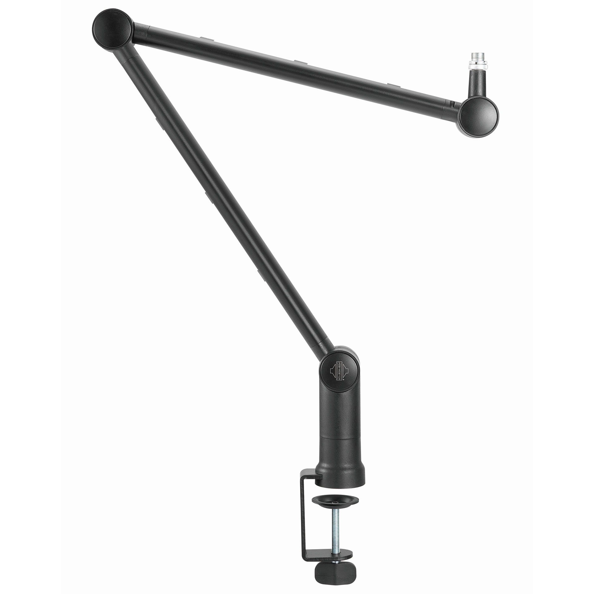

# things to discuss

## physical setup

EEG headset + GSR OK

VR glass gemakkelijkste als we het kunnen hangen van achter het kind en aanpassen dat het gestrapt wordt op zijn/haar hoofd. ==> minder gewicht continu en minder problemen met strap. 

## Gameplay

slingshot ok? Er zijn denk ik voldoende manieren om dit stressy te krijgen, maar we behouden het zittend gegeven, goed voor de EEG metingen.

## contingency

hoe definieren we dit bij competitieve stress? 
Voorbeeld: 80% cont:
- Wat doet de tegenspeler? 
	- Blijft die altijd op zelfde niveau spelen? 
	- Speelt hij soms beter/slechter?
- krijgen we 80% van de keren goede feedback op onze performance?
	- aanmoedigend indien goed gescoord
	- oppeppend indien slechte performance
- krijgen we 20% van de keren slechte feedback?
	- ?
	- ?
- 